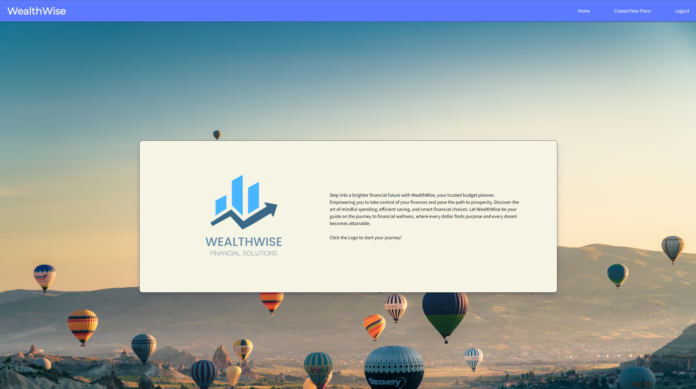

# WealthWise

Link to deployed page: [https://wealthwise-project2-1bf71934d0b7.herokuapp.com/](https://wealthwise-project2-1bf71934d0b7.herokuapp.com/)

WealthWise is an application that allows users to make monthly budget plans according to their spending habits. One of the features of WealthWise is its ability for users to add or delete expenses and view their through out the month to allow the user to adjust their balanaces accordingly. WealthWise is an application developed during bootcamp at the UCB Web Development bootcamp.

This application makes use of the following NPM packages:

| Badge Name                | Badge                                                                                                                                                       | Link                                                        |
| ------------------------- | ----------------------------------------------------------------------------------------------------------------------------------------------------------- | ----------------------------------------------------------- |
| Faker                     | [](https://www.npmjs.com/package/@faker-js/faker)                                                         | [npm](https://www.npmjs.com/package/@faker-js/faker)           |
| Bcrypt                    | [](https://www.npmjs.com/package/bcrypt)                                                              | [npm](https://www.npmjs.com/package/bcrypt)                    |
| Chart.js                  | [](https://www.npmjs.com/package/chart.js)                                                           | [npm](https://www.npmjs.com/package/chart.js)                  |
| Connect-Session-Sequelize | [](https://www.npmjs.com/package/connect-session-sequelize) | [npm](https://www.npmjs.com/package/connect-session-sequelize) |
| Dotenv                    | [](https://www.npmjs.com/package/dotenv)                                                          | [npm](https://www.npmjs.com/package/dotenv)                    |
| Express                   | [](https://www.npmjs.com/package/express)                                                      | [npm](https://www.npmjs.com/package/express)                   |
| Express-Handlebars        | [](https://www.npmjs.com/package/express-handlebars)                   | [npm](https://www.npmjs.com/package/express-handlebars)        |
| Express-Session           | [](https://www.npmjs.com/package/express-session)                                  | [npm](https://www.npmjs.com/package/express-session)           |
| Handlebars                | [](https://www.npmjs.com/package/handlebars)                                             | [npm](https://www.npmjs.com/package/handlebars)                |
| MySQL2                    | [](https://www.npmjs.com/package/mysql2)                                                           | [npm](https://www.npmjs.com/package/mysql2)                    |
| Sequelize                 | [](https://www.npmjs.com/package/sequelize)                                                  | [npm](https://www.npmjs.com/package/sequelize)                 |
| Tabulator Tables          | [](https://www.npmjs.com/package/tabulator-tables)                              | [npm](https://www.npmjs.com/package/tabulator-tables)          |
| HTML5                     |                                                                                                         | -                                                           |
| ES6                       |                                                                                                             | -                                                           |
| CSS                       |                                                                                                               | -                                                           |

Landing Page:



## Installation

For Development:

1. Clone or fork the repository using ""
2. Navigate to the root directory of the project using CLI.
3. Install node modules using "npm install"
4. Create a .env file to store your MySQL credentials
5. Create the database by running "mysql -u root -p" then enter your password.
6. Once you are connected to MySQL, from the CLI type: "source /db/schema.sql"

**MySQL and Node.js will need to be installed by the user.**

Link to MySQL Downloads: [https://www.mysql.com/downloads/](https://www.mysql.com/downloads/)

Link to Node.js Downloads: [https://nodejs.org/en](https://nodejs.org/en)

## Usage

1. Visit the deployed page at: [https://wealthwise-project2-1bf71934d0b7.herokuapp.com/](https://wealthwise-project2-1bf71934d0b7.herokuapp.com/)
2. Click the option to sign-up if it is your first time visiting the site, if you already have a user account hit login
3. Once logged click create budget
4. You will be prompted to provide a name for your budget - Note no two budges can have the same name.
5. The next screen will allow you to input your known monthly expenses and income. you will need to provide a name category and amount. Description is optional.
6. When you add a new item it will appear dynamically inside of the tables respective of their types. You can delete an item by hitting the x button on the table.
7. Once you are content you will need to hit the submit button to save your plan.
8. You will be taken to a window that will display charts and tables corresponding to your values you have selected you will also be given a monthly financial breakdown of your costs and income values as well as your net gain or loss.
9. You can edit your plan by clicking on the View Budgets to return to the area to add or remove items from that saved plan.

## Code Highlights

Code snippet of data being seeded using fakerJs.

```javascript
const { faker } = require("@faker-js/faker");
const { User, Expense } = require("../models");

const createUsersExpenses = async () => {
  const users = await User.findAll();
    for (const user of users) {
      const expenses = [...Array(10)].map((expense) => ({
        expense_name: faker.commerce.productName(),
        user_expense_id: user.id,
        amount: faker.commerce.price(),
        description: faker.commerce.productDescription(),
        category: faker.commerce.department(),
        date: faker.date.past(),
      }));
      await Expense.bulkCreate(expenses);
    }
};
module.exports = createUsersExpenses;

```

Code snippet of a data model using life-cycle hooks to control data validation and formatting:

```javascript
class Expense extends Model {}

Expense.init(
  {
    id: {
      type: DataTypes.INTEGER,
      allowNull: false,
      primaryKey: true,
      autoIncrement: true,
    },
    expense_name: {
      type: DataTypes.STRING,
      allowNull: false,
      validate: {
        len: [1, 255],
      },
    },
    user_expense_id: {
      type: DataTypes.INTEGER,
      references: {
        model: "user",
        key: "id",
      },
    },
    budget_id: {
      type: DataTypes.INTEGER,
      references: {
        model: "budget",
        key: "id", 
      },
    },
    amount: {
      type: DataTypes.DECIMAL(10, 2),
      allowNull: false,
      validate: {
        isNumeric: true,
      },
    },
    description: {
      type: DataTypes.STRING,
      allowNull: false,
      validate: {
        len: [0, 255],
      },
    },
    category: {
      type: DataTypes.STRING,
      allowNull: false,
      validate: {
        len: [1, 255],
      },
    },
    date: {
      type: DataTypes.DATE,
    },
  },
  {
    hooks: {
      async beforeCreate(newExpenseData) {
        if (newExpenseData.description === null) {
          newExpenseData.description = "No description provided.";
        }
        if (newExpenseData.description.length > 255) {
          newExpenseData.description = newExpenseData.description.substring(
            0,
            255
          );
        }
        if (newExpenseData.description.length < 1) {
          newExpenseData.description = "No description provided.";
        }
        if (newExpenseData.amount === null) {
          newExpenseData.amount = 0.0;
        }
        if (typeof newExpenseData.amount === "number") {
          newExpenseData.amount = parseFloat(newExpenseData.amount).toFixed(2);
        }
        return newExpenseData;
      },
    },
    sequelize,
    timestamps: false,
    freezeTableName: true,
    underscored: true,
    modelName: "expense",
  }
);
```

## Learning Points

Building MySQL Databases, Tables, Cookies and authentication handling. Alternatives to storing plain text passwords using databases. Front end / Back end integration using Restful routes. Creating and manipulating data using MySQL and Sequelize. Use of ORMs. And front-end / back-end integration.

## Author

Michael Mattingly

* [LinkedIn](https://www.linkedin.com/in/michael-mattingly-5580b1280/)

Xiaoran Cai

* [LinkedIn](https://www.linkedin.com/in/xrcai/)

Karen Shirvanyan

* [LinkedIn](https://www.linkedin.com/in/karen-shirvanyan-8a46a01a3/)


This project uses the following packages:

* Node.js - [https://nodejs.org/en](https://nodejs.org/en)
* MySQL - [https://www.mysql.com/](https://www.mysql.com/)
* MySQL2 - [https://www.npmjs.com/package/mysql2](https://www.npmjs.com/package/mysql2)
* Bcrypt - [https://www.npmjs.com/package/bcrypt](https://www.npmjs.com/package/bcrypt)
* Connect-session-sequelize - [https://www.npmjs.com/package/connect-session-sequelize](https://www.npmjs.com/package/connect-session-sequelize)
* Dotenv - [https://www.npmjs.com/package/dotenv](https://www.npmjs.com/package/dotenv)
* Express - [https://www.npmjs.com/package/express](https://www.npmjs.com/package/express)
* Express-handlebars - [https://www.npmjs.com/package/express-handlebars](https://www.npmjs.com/package/express-handlebars)
* Handlebars - [https://www.npmjs.com/package/handlebars](https://www.npmjs.com/package/handlebars)
* Express-session - [https://www.npmjs.com/package/express-session](https://www.npmjs.com/package/express-session)
* Sequelize - [https://www.npmjs.com/package/sequelize](https://www.npmjs.com/package/sequelize)

## License

This project is licensed under the [MIT License](https://github.com/MeanBean87/readme-generator/blob/main/LICENSE). Please refer to the LICENSE file for more details.
